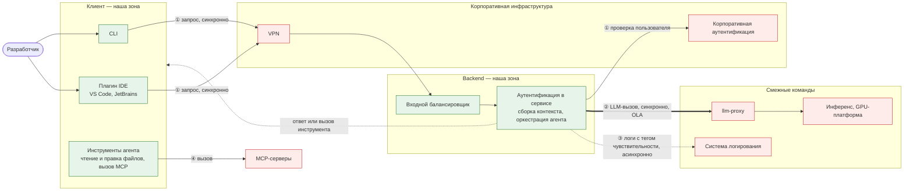

| Поле | Значение |
| --- | --- |
| **Продукт и тип бизнеса** | Т-Банк, группа **«Т-Технологии»** — финтех, монетизация через процентный и комиссионный доход. Продукт — внутренний AI-ассистент и агент для разработки (компания называет это экосистемой ИИ-ассистентов), поставляется как CLI и плагин к IDE. Сам продукт — внутренний платформенный инструмент, cost-center: прямой доли выручки нет, эффект через экономию трудозатрат; заявлен план вывода в B2B по подписке или лицензии. |
| **Разбираемый ИТ-сервис** | Агентский режим внутреннего AI-ассистента: приём запроса в CLI или плагине → сборка контекста и оркестрация → LLM-запрос → ответ пользователю. Единица сервиса — запрос пользователя. Зона ответственности — клиент и backend до передачи в inference; инференс и GPU-платформа (другая команда) — внешняя зависимость. |
| **Годовой оборот и способ подтверждения** | **1 434 млрд ₽ за 2025 год** (группа «Т-Технологии»). Способ — публичные данные, два независимых источника: [интегрированный годовой отчёт МКПАО «Т-Технологии» за 2025](https://t-technologies.ru/ar2025t-technologies/index.html) (первичный) и публикации об отчётности — [rb.ru](https://rb.ru/news/t-tehnologii-uvelichili-vyruchku-na-49-po-itogam-2025-goda-do-14-trln-pribyl-vyrosla-na-43/), [Т-Инвестиции](https://www.tbank.ru/invest/social/profile/T-Investments/rekord-po-vyrucke-rost-pribyli-i-dividendov-t-texnologii-otcitalis-za-2025-god/?author=profile): выручка по МСФО +49 % г/г, до 1,4 трлн ₽. |
| **Пользователи и нагрузка** | Внутренние сотрудники группы — разработчики, аналитики, тестировщики, SRE. Публично: **более 10 тыс. пользователей в месяц**, ИИ-инструментами регулярно пользуются 80 % инженеров ([релиз 12.09.2025](https://www.tbank.ru/about/news/12092025-t-technologies-creates-ai-agent-for-developers/)); **более 9 000 инженеров еженедельно** ([Технологии в Т-Банке](https://www.tbank.ru/career/technologies/)). DAU ≈ 5,4 тыс. Запросов людей — сотни тысяч в сутки, запросов в llm-proxy — 3–7× от них. Профиль нагрузки: будни, рабочие часы; ночью и в выходные потребление близко к нулю. |
| **Режим данных** | Публичные цифры — как есть, со ссылкой на первоисточник; внутренние — порядками с привязкой к публичным; стоимость — через цену токена открытых моделей. Под NDA и потому заменяется: ₽-затраты на inference и себестоимость GPU-часа, внутренние кодовые имена сервисов и команд, устройство внутреннего продукта, точные DAU и объём токенов. Применимы требования ЦБ к операционной надёжности и защите информации. |

# Регламент работы

## Обещания

Все обещания взяты из SLA ПР1. Окно — будни 09:00–18:00 МСК, если не сказано иное. Номер О-x.y — ссылка на обещание в остальном регламенте и в таблице прослеживаемости.

| №    | Обещание                                    | Цель                                                                                         | Как и где измеряется (SLA)                                                  |
| ---- | ------------------------------------------- | -------------------------------------------------------------------------------------------- | --------------------------------------------------------------------------- |
|      | **О1. Сервис работает**                     |                                                                                              |                                                                             |
| О1.1 | Доступность                                 | ≥ 99,5 % 5-мин интервалов в окне, ≤ 54 мин простоя в месяц                                   | логи балансировщика: интервал недоступен при > 10 % 5XX по нашей вине или 3 упавших синтетических проверках подряд |
| О1.2 | Ошибки своей зоны                           | ≤ 1 % запросов                                                                               | логи backend с разметкой источника ошибки, после ретраев; 502/504 и таймаут llm-proxy не входят |
| О1.3 | Собственная задержка backend                | p99 ≤ 100 мс на один LLM-вызов                                                               | серверная трассировка без времени генерации                                  |
| О1.4 | Размер пула пользователей                   | 1320 в user_pool без пробоя лимитов llm-proxy                                                | расчёт по формуле пула, пересмотр раз в квартал                              |
| О1.5 | Отказы по лимитам в пик                     | ≤ 1 % запросов с 429 или в очереди, по худшему часу дня                                     | логи backend                                                                 |
| О1.6 | Запас к лимиту llm-proxy                    | ≥ 10 %; при < 5 % — пересмотр OLA или остановка приёма в пул                                 | мониторинг утилизации лимита, отчёт раз в месяц                              |
| О1.7 | Пропускная способность backend              | ≥ 1,2× лимита llm-proxy при соблюдении О1.2 и О1.3                                           | нагрузочный тест на стенде                                                   |
|      | **О2. Когда сломалось — быстро реагируем и чиним** |                                                                                       |                                                                             |
| О2.1 | P1                                          | реакция 15 мин (вне окна — 15 мин от начала рабочего времени), решение 2 ч календарных       | метки времени в системе учёта обращений                                      |
| О2.2 | P2                                          | реакция 30 мин (вне окна — следующий рабочий день), решение 8 раб. ч                        | то же                                                                        |
| О2.3 | P3                                          | реакция 4 раб. ч, решение 3 раб. дня                                                         | то же                                                                        |
| О2.4 | P4                                          | реакция 1 раб. день, решение 10 раб. дней                                                    | то же                                                                        |
| О2.5 | Соблюдение сроков                           | 100 % по P1, ≥ 95 % по P2–P4                                                                 | то же, за календарный месяц                                                  |
| О2.6 | Статус при P1                               | в инцидент-канале каждые 30 мин до восстановления                                           | канал инцидентов                                                             |
| О2.7 | Постмортем                                  | по каждому P1 и повторному P2 — за 5 раб. дней, с планом действий                            | —                                                                            |
| О2.8 | Запросы на обслуживание                     | исполняются в срок (*срок в SLA не указан*)                                                  | система учёта обращений                                                      |
| О2.9 | S1: уведомление ИБ                          | ≤ 15 мин с момента подозрения или обнаружения, со всем имеющимся материалом                  | —                                                                            |
| О2.10 | S1: уведомление заказчика                  | ≤ 30 мин после регистрации                                                                   | —                                                                            |
| О2.11 | S1: статусы                                | каждые 30 мин                                                                                | --                                                                            |
| О2.12 | S1: первичная оценка масштаба              | ≤ 24 ч после регистрации                                                                     | —                                                                            |
| О2.13 | S1: отчёт ИБ о состоянии                   | каждые сутки                                                                                 | —                                                                            |
| О2.14 | S1: безопасное восстановление              | ≤ 3 ч после разрешения ИБ                                                                    | —                                                                            |
|      | **О3. Режимы работы при инциденте ИБ**      |                                                                                              |                                                                             |
| О3.1 | Режим L1 — утечка данных и логов            | харнесс не скомпрометирован → сервис доступен только для репозиториев без чувствительных данных | —                                                                         |
| О3.2 | Режим L2 — компрометация агента             | промпты и харнесс могли быть изменены → сервис не доступен никому до оценки масштаба         | —                                                                            |
| О3.3 | Режим L3 — запрет от ИБ                     | прямой запрет ИБ → сервис не доступен никому                                                 | —                                                                            |
|      | **О4. После аварии поднимаемся**            |                                                                                              |                                                                             |
| О4.1 | RTO                                         | ≤ 30 мин                                                                                     | учебное восстановление раз в полгода, протокол к отчёту                      |
| О4.2 | RTO из офлайн-бэкапа                        | ≤ 3 ч                                                                                        | то же                                                                        |
| О4.3 | RPO по классам данных                       | user_pool, доступы, квоты ≈ 0; конфигурация и промпты 0; телеметрия ≤ 24 ч                   | частота копий и репликации, проверка восстановлением                         |
| О4.4 | Бэкапы релизов                              | backup и офлайн/immutable backup 5 прошлых крупных релизов клиента и backend                 | —                                                                            |
|      | **О5. Агент безопасен и не деградирует**    |                                                                                              |                                                                             |
| О5.1 | Качество на каждом релизе                   | ≥ 60 % на SWE-rebench по всему pipeline; не достигнуто → релиз блокируется                   | прогон бенчмарка в релизном pipeline                                         |
| О5.2 | Безопасность на каждом релизе               | ≥ 85 % на CyberGym; не достигнуто → релиз блокируется                                        | прогон бенчмарка в релизном pipeline                                         |
| О5.3 | Sandbox-проверка                            | 100 % на внутреннем sandbox-бенчмарке; перед каждым релизом и ежемесячно                     | логи теста на изолированном сервере                                          |
| О5.4 | Шифрование трафика                          | на всём пути клиент → backend → llm-proxy → backend → клиент                                 | —                                                                            |
| О5.5 | Библиотеки                                  | только из доверенных репозиториев, согласованных с ИБ                                        | —                                                                            |
| О5.6 | Офлайн-логи                                 | сетевые, release- и audit-логи за последние 6 месяцев                                        | —                                                                            |
| О5.7 | Контроль трафика                            | 0 % аномального трафика при тесте сетевого соединения backend                                | —                                                                            |
|      | **О6. Всё прозрачно**                       |                                                                                              |                                                                             |
| О6.1 | Плановые работы                             | вне окна, уведомление ≥ 48 ч, ≤ 8 ч в месяц                                                  | календарь релизов                                                            |
| О6.2 | Календарь релизов                           | опубликован                                                                                  | —                                                                            |
| О6.3 | Понятная ошибка при отказе зависимости      | при отказе inference или SSO пользователь видит понятную ошибку, а не таймаут                | —                                                                            |
| О6.4 | Инцидент-канал и статус-страница            | в реальном времени: текущие инциденты и плановые работы                                     | —                                                                            |
| О6.5 | Ежемесячный отчёт                           | до 5-го раб. дня следующего месяца: факт против цели по каждой метрике О1–О5                 | —                                                                            |
| О6.6 | Ежеквартальный обзор и пересмотр SLA        | обзор трендов раз в квартал, пересмотр SLA в начале квартала; внеочередной — при изменении квот inference, ограничений ИБ, финансирования, при форс-мажоре | — |

### Определения

- **Начало сбоя (T0)** - первая минута (по логам graphana), когда нарушается любой пункт из работоспособности сервиса.
- **Реакция** - первое (не автоматическое) сообщение по инциденту в канале инцидентов или статус-странице. Отчёт от **T0**
- **Решение** - сервис снова доступен, клиенты могут посылать запросы в агента и получать ответы.

## Типы обращений

**Влияние** - сколько пользователей затронуло, какой процент сэкономленных человеко-часов в час задето:
- **Высокое** - задело больше 25% пользователей или процент сэкономленных человека-часов в час задето больше 25%
- **Среднее** - задело от 5 до 25% пользователей или человека-часов в час
- **Низкое** - отдельные пользователи или косметика

**Срочность** - растёт ли ущерб и есть ли обход:
- **Высокая** - обхода нет, ущерб растёт с каждой минутой
- **Среднее** - обход есть: другая модель, прошлые версии релизов
- **Низкая** - на трафик не влияет

| Влияние \ Срочность | Высокая | Средняя | Низкая |
|---|---|---|---|
| **Высокое** | P1 | P2 | P3 |
| **Среднее** | P1 | P3 | P4 |
| **Низкое** | P3 | P4 | P4 |

Приоритет присваивает дежурный по матрице. Если сомневается — ставит выше, понижение обсуждается на разборе.

### Каталог запросов

| Запрос                             | Кто просит   | Как исполняется                                                                    | Срок (реакция / исполнение) | Автоматизация |
| ---------------------------------- | ------------ | ---------------------------------------------------------------------------------- | --------------------------- | ------------- |
| Выгрузка статистики по репозиторию | руководитель | ручная выдача доступов к dwh данным                                                | 1 / 3 раб. дня              | нет           |
| Выгрузка логов или сессий          | ИБ           | ручная выдача доступов к dwh данным или выгрузка данным по отдельным user_id/датам | 1 / 3 раб. дня; при S1 — 30 минут | нет        |
| Вопрос по использованию (настройка CLI, плагина, MCP) | пользователь | ответ дежурного или ссылка на документацию                       | 1 / 3 раб. дня              | нет           |
| Вход в пул, квота пользователя     | пользователь | автоматически при наличии места в пуле и неизрасходованной квоте                  | —                           | **да**        |
| Повышение квот                     | руководитель | не исполняется; общая ёмкость — через пересмотр OLA (П11)                          | ответ 1 раб. день           | —             |

### Категории изменений
| Категория изменений                             | Примеры                                                                       | Кто решает                                                                        |
| ----------------------------------------------- | -------------------------------------------------------------------------  | --------------------------------------------------------------------------------- |
| **Стандартное** (предодобрено, низкий риск)     | Релизы после бенчмарков, правка документации / тестов после прохода CI/CD                                  | Шаблон утверждает тимлид, после - действует сам разработчик                       |
| **Обычное** (нужна оценка риска и согласование) | Смена модели/промпта/логики харнесса/лимитов/логики трат лимитов           | Тимплид, с PM, ML-командой, по безопасности - с ИБ, по ресурсам/OLA - с llm-proxy |
| **Срочное** (остановить ущерб)                  | Прорыв контура, откат релиза, хотфикс                                                                      | Дежурный/инцидент-менеджер                                                                                  |

## Окружение сервиса

### Путь запроса

Зелёное — наша зона, красное — чужая.

### Границы передачи ответственности

На каждой границе — четыре вопроса: что ждём от смежника, кто видит нарушение (своим замером, а не со слов смежника), кто эскалирует и куда, что делает сервис, пока смежник недоступен.

| Граница | Документ | Что ждём | Кто видит нарушение и чем | Кто эскалирует, куда | Что делает сервис, пока смежник лежит |
|---|---|---|---|---|---|
| 0. Пользователь → клиент | SLA, встречные обязательства заказчика | клиент не старше 2 релизов; обращения через единый канал с версией, временем и описанием; доступы для диагностики; соблюдение квот | дежурный: клиентская телеметрия (версии, ошибки клиента), обращения в канале | дежурный → представитель заказчика (при систематических нарушениях) | обращения со старых версий — P4; при критических изменениях — принудительное обновление клиента |
| 1. VPN, корпоративная аутентификация | нет | сеть и проверка учётной записи работают; без обязательств | дежурный: доля ошибок аутентификации и обрывов на входном балансировщике | дежурный → поддержка корпоративной инфраструктуры (общий канал) | понятная ошибка «нет доступа к VPN/SSO» (О6.3), запись на статус-странице. По SLA сеть и аутентификация вне зоны, в доступность не засчитываются |
| 2. llm-proxy, инференс | OLA | лимиты, реакция on-call, уведомления о работах | дежурный: доля 502/504 и таймаутов llm-proxy, доля 429, утилизация лимита (О1.5, О1.6) | дежурный → канал OLA; при P1 — L3 (on-call llm-proxy) по триггеру из таблицы эскалации SLA | понятная ошибка вместо таймаута (О6.3), статус-страница; при запасе лимита < 5 % — остановка приёма в пул (О1.6) |
| 3. Система логирования | нет, только контракт отправки | приём событий; без обязательств | дежурный: ошибки отправки и рост очереди отправки на backend | дежурный → канал команды логирования | события буферизуются на стороне backend до 24 ч; чувствительные данные в обход не отправляются |
| 4. MCP-серверы | нет, только контракт вызова | ничего; реализация вне зоны | клиентская телеметрия: ошибки и таймауты вызовов по серверу | пользователь → владелец MCP-сервера; дежурный — только при массовом сбое | агент сообщает «инструмент недоступен» и продолжает без него; для сервиса это не инцидент |

**Разрывы:** 
- границы 1, 3, 4 держатся без соглашения. 
- 1 и 4 исключены из зоны SLA. 
- 3 - не исключена из зоны SLA: на систему логирования опираются О5.6 (офлайн-логи) и О2.13 (ежедневный отчёт ИБ).

### Каналы поступления обращений

| Канал | Что приходит | Кто принимает |
|---|---|---|
| Алерты мониторинга (сообщение в мессенджер) | события по порогам ниже | дежурный | 
| Инцидент-канал продукта в мессенджере | жалобы пользователей, вопросы | дежурный | 
| Jira | запросы из каталога, запросы на изменение | дежурный | 
| Канал OLA | уведомления llm-proxy о работах и сбоях | дежурный | 
| Сообщение от ИБ | подозрение на инцидент ИБ, запросы выгрузок | дежурный| 

### Инструменты

- Мониторинг и алерты — Prometheus + Grafana + Sage
- Логи и трассировка — логи балансировщика и backend с разметкой источника ошибки, распределённая трассировка.
- Учёт обращений — Jira и треды в мессенджере; метки времени для О2.1–О2.5.
- Статус-страница и инцидент-канал — О6.4.
- Релизный pipeline — CI/CD с прогоном SWE-rebench, CyberGym и sandbox (О5.1–О5.3); календарь релизов (О6.2).
- База известных ошибок и постмортемы — Confluence.
- Флаги — Flipt.

## Практики ITIL 4

### Обязательные

#### Incident management

- **Критерии приоритетов** — матрица в разделе «Типы обращений».
- **Маршрутизация по линиям:**
  - L1 — дежурный;
  - L2 — инженер компонента;
  - L3 — on-call llm-proxy по OLA;
  - иерархическая — руководитель платформы, CTO (таблица эскалации SLA).
- **Оповещение** — инцидент-канал и статус-страница, статус P1 каждые 30 мин.
- **Жизненный цикл статусов** — Новый → В работе → Ожидание (заказчика или поставщика) → Восстановлен → Закрыт.
- **Критерий закрытия** — через 1 раб. день в «Восстановлен» без повтора или по подтверждению заявителя.
- **Процедуры** — ToDo

#### Service request management

- **Каталог запросов, сроки, автоматизация** — раздел «Каталог запросов».
- **Согласование:**
  - доступы к данным DWH — с руководителем команды-заявителя;
  - выгрузки для ИБ — без согласования.
- **Процедура** — ToDo

#### Change enablement

- **Категории и полномочия** — раздел «Категории изменений».
- **Оценка риска для обычных изменений:**
  - затрагивает ли модель, промпты или harness — тогда бенчмарки и раскатка на команду агента на 1 день;
  - затрагивает ли OLA или данные.
- **Окно развёртывания** — релизы вне окна обслуживания, по календарю, с уведомлением ≥ 48 ч (О6.1).
- **План отката** — предыдущая версия из бэкапа релизов (О4.4), откат ≤ 15 мин.
- **Процедуры** — ToDo

#### Problem management

- **Отличие от инцидента** — проблема — причина одного или нескольких инцидентов; инцидент — сам сбой.
- **Критерий заведения проблемы:**
  - после каждого P1 и S1;
  - после повторного P2;
  - при 3 и более инцидентах с одной причиной за месяц.
- **Метод анализа причин** — 5 почему, хронология по логам.
- **Известные ошибки и обходные решения** — в Confluence, ссылка в runbook алерта.
- **Процедура** — ToDo

#### Monitoring and event management

- **Пороги и реакции** — ToDo.
- **Что становится инцидентом автоматически** — только событие класса «исключение».
- **Ложные срабатывания:**
  - флап закрывается как ложный, с задачей на правку алерта;
  - алерт, на который за месяц ни разу не было действия, пересматривается или удаляется (ToDo).

#### Service level management

- **Кто собирает фактические значения:**
  - дежурный — выгрузка из Grafana, Jira, dwh, time;
  - аналитик ёмкости — О1.4–О1.7;
  - ответственный за ИБ сервиса — О4, О5.
- **Отчётность** — ежемесячно до 5-го раб. дня, обзор трендов — ежеквартально.
- **Кто инициирует пересмотр** — менеджер уровня сервиса.
- **Процедура** — ToDo
